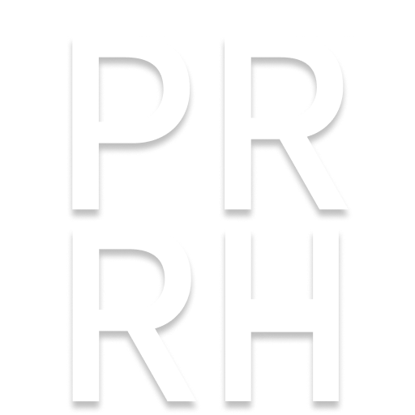

<p align='center'>

</p>

# 罗德岛远程指挥部


> P.R.R.H —— Primitive Rhodes Island Remote Headquarter

## 介绍

> 通过浏览器扩展帮助博士网上冲浪时实时监控罗德岛运行状态

由工程部提供的诸多功能：

- 🧠 显示博士的剩余理智及恢复情况
- 👋 罗德岛内公开招募进行情况
- 💰 与外部单位合作业务如保全派驻、剿灭作战工作进展
- 📚 支持多账号/多名博士的岛上实时信息
- 👨‍🔧 更多功能由工程部正在紧锣密鼓的开发中...

## 项目状态

[](https://wakatime.com/badge/user/a826b75e-c927-45c8-9342-26f296c2189f/project/018ee515-32dd-4135-82a1-d5736a2f365d)


[](https://chrome.google.com/webstore/detail/%E7%BD%97%E5%BE%B7%E5%B2%9B%E8%BF%9C%E7%A8%8B%E6%8C%87%E6%8C%A5%E9%83%A8/cbnldploflpmmkmcbhipaoojkdmillkm)

## 下载

[Chrome Webstore](https://chrome.google.com/webstore/detail/%E7%BD%97%E5%BE%B7%E5%B2%9B%E8%BF%9C%E7%A8%8B%E6%8C%87%E6%8C%A5%E9%83%A8/cbnldploflpmmkmcbhipaoojkdmillkm)

## 开发

请确保本地安装了 Node.js 和 pnpm 以及开发目标浏览器， 同时建议你用 Visual Studio Code 进行开发。

```sh
# 安装依赖
pnpm install

# 运行项目
pnpm dev
```

运行项目会自动打开 chrome 浏览器并添加扩展至扩展列表。

## 端到端测试

**TBD**

> 集成了 playwright 但是有一定限制，无法覆盖所有情况

## 特别鸣谢

- [wxt](https://github.com/wxt-dev/wxt) 基于 vite 的浏览器扩展框架
- [Enhance-for-Skland](https://github.com/LaviniaFalcone/Enhance-for-Skland) 接口类型定义参考

## 协议

[](LICENSE)
